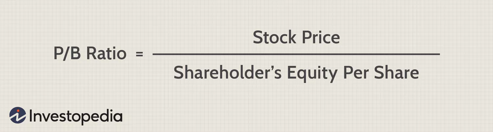

**简体中文** | [English](./README.en.md)
# PB-ROE研究，行业对比及数据分析

#### PB-ROE的中文翻译为市净率-净资产收益率，是英文（Price/Book ratio – Return On Equity ）的缩写。PB-ROE估值模型是市场上常用的比较估值方法，其假设是：投资者愿意为成长性更好的上市公司付出更高的股价。

#### 依照Investopedia上的描述，高市净率不一定对应高股本回报率(ROE)，但在理想情况下确实如此。投资者青睐股本回报率更高的公司；结果，这种青睐转化为更高的公司价格。可以理解的是，低 P/B 比率通常与不良的 ROE 和资产回报率 (ROA) 相关。

#### ROE 是衡量利润效率的指标，是衡量盈利能力与股东投入资本金额的函数的股权估值。该指标提供了对该股权投资回报的百分比评估。

#### 将 P/B 比率评估与 ROE 评估一起考虑是有用的，因为它们都考虑了股权的账面价值。这两种估值工具都不是完美无缺的，因此检查一个估值与另一个估值是有帮助的。P/B和ROE从不同的角度评价一只股票，但它们是相关的；它们都计入了权益的账面价值。

#### 较为明智的评估方法是结合衡量指标，例如检查这些年 P/B 和 ROE的数据趋势。因此此研究通过对A股20年内各个股票进行估值，进而得以衡量同一行业所有股票中最有发展前景的那一个。
#### 选取每年年报的财务ROE与次年4月30日的PB。为了防止极端数据影响，剔除ROE大于50或小于-50的点，以及PB大于50或小于0个股。

1. 按年度统计，过去20年，全部A股的PB-ROE线性拟合相关系数、斜率、截距。

2. 统计过去20年，全部A股不同行业（中信一级）的PB-ROE相关系数、线性拟合斜率、截距，20年的中值对比一遍，20年的总数据对比一遍，每个企业每年一遍。

3. 按年度统计，过去20年，基础化工、石油石化行业的PB-ROE线性拟合相关系数、斜率和截距。

#### 值得提及的一点，其中对相关系数、斜率、截距三者进行了可视化处理，能够更轻松地看到相关要点。